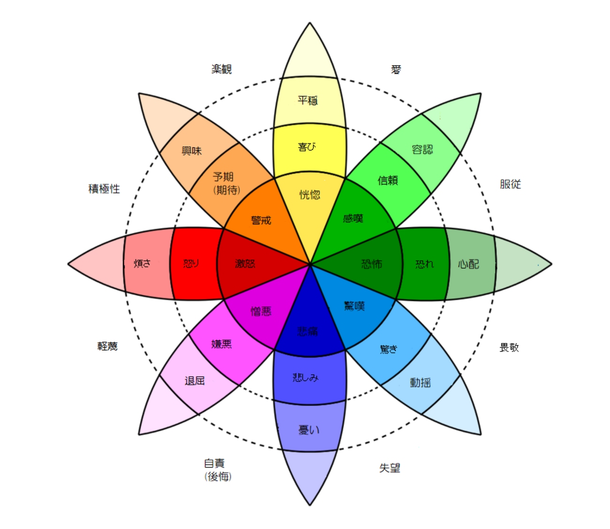

# J-POP コード進行と歌詞感情の可視化分析システム

## 概要

本研究は、J-POP における**コード進行パターン**と**歌詞の感情表現**の関係性を分析・可視化するシステムである。次元削減手法（**MDS** / **UMAP** / **t-SNE**）を用いてコード進行の類似性を 2 次元平面上にマッピングし、各点に歌詞から抽出した感情分布を円グラフとして表示する。

### 研究目的

1. J-POP におけるコード進行パターンと歌詞の感情表現の関係性を定量的に分析する
2. 「王道進行」「小室進行」「丸サ進行」などの定番コード進行を基準とした楽曲の分布を可視化する
3. 作曲家・作詞家・アーティストごとの特徴を分析できるインタラクティブな可視化ツールを開発する
4. **時代ごとのコード進行の使用傾向の変遷**を分析し、J-POP の音楽的トレンドを明らかにする
5. **人気楽曲に共通するコード進行パターン**を発見し、ヒット曲の音楽的特徴を解明する

---

## 提案手法

### 1. データ収集と採用基準

#### 1.1 データソース

本システムでは、以下の 3 つのソースからデータを収集している：

| ソース              | 取得データ                                 | 収集方法                        |
| ------------------- | ------------------------------------------ | ------------------------------- |
| **J-Total Music**   | コード進行（原曲キー付き）                 | Web スクレイピング（静的 HTML） |
| **U-FRET**          | コード進行 + 歌詞（セクション区切り）      | Playwright（動的レンダリング）  |
| **Spotify Web API** | メタ情報（リリース日、人気度、アルバム等） | API 検索                        |

#### 1.2 データ収集パイプライン

```
┌─────────────────┐    ┌─────────────────┐    ┌─────────────────┐
│   J-Total       │    │    U-FRET       │    │    Spotify      │
│  パス一覧取得   │    │  ID: 1〜188318  │    │   API検索       │
└────────┬────────┘    └────────┬────────┘    └────────┬────────┘
         │                      │                      │
         ▼                      ▼                      ▼
┌─────────────────┐    ┌─────────────────┐    ┌─────────────────┐
│  HTMLパース     │    │  Playwright     │    │  曲名+アーティ  │
│  コード進行抽出 │    │  動的DOM取得    │    │  スト名で検索   │
└────────┬────────┘    └────────┬────────┘    └────────┬────────┘
         │                      │                      │
         └──────────────────────┼──────────────────────┘
                                │
                                ▼
                    ┌───────────────────────┐
                    │  Spotify IDでマッチング│
                    │  両サイトに存在する曲  │
                    │  のみを結合データに採用│
                    └───────────┬───────────┘
                                │
                                ▼
                    ┌───────────────────────┐
                    │  data/combined/       │
                    │  結合済みJSONファイル  │
                    └───────────────────────┘
```

#### 1.3 データ結合条件

**採用条件**:  
J-Total と U-FRET の**両方に存在**し、**Spotify ID が一致**する楽曲のみを採用

```python
# 結合ロジック（簡略化）
for spotify_id in jtotal_data.keys():
    if spotify_id in ufret_data:
        # 両サイトにデータが存在 → 採用
        combined_item = {
            'jtotal_chord_progressions': jtotal_data[spotify_id],
            'ufret_chord_progressions_and_lyrics': ufret_data[spotify_id],
            # メタ情報はU-FRETを優先、なければJ-Totalから
            'release_date': ufret_data[spotify_id].get('release_date')
                           or jtotal_data[spotify_id].get('release_date'),
            ...
        }
```

**この条件の根拠**:

1. **データ品質の担保**: 2 つの独立したソースで同一楽曲と確認できた場合のみ採用
2. **コード進行の検証**: J-Total と U-FRET のコード進行を比較し、移調量を推定
3. **歌詞との対応**: U-FRET はセクションごとの歌詞を提供するため、コード進行と歌詞の対応関係が明確

#### 1.4 分析時のフィルタリング条件

可視化の品質を確保するため、以下の条件でデータをフィルタリングしている：

| 条件             | 値           | 根拠                                       |
| ---------------- | ------------ | ------------------------------------------ |
| **コード進行長** | 4 コード     | 最も一般的な小節構造（4/4 拍子 × 4 小節）  |
| **最小コード数** | 12 以上      | 楽曲全体で 12 コード以上（キー推定に必要） |
| **感情閾値**     | 最大値 ≥ 0.5 | BERT の出力が低すぎる場合はノイズとみなす  |

#### 1.5 なぜ 4 コード進行なのか

コード進行を 4 コード単位で抽出する理由：

1. **音楽的自然さ**: J-POP の大多数は 4/4 拍子で、4 小節（= 4 コード）が基本単位
2. **分析の一貫性**: 異なる長さの進行を比較するのは困難（3 コードと 8 コードでは特徴が異なる）
3. **代表的な進行との比較**: 王道進行・小室進行・丸サ進行はすべて 4 コードで定義されている
4. **計算効率**: 固定長にすることで距離行列の計算が効率化される

#### 1.6 なぜ最小コード数 12 以上なのか

「最小コード数 12 以上」とは、**楽曲全体に含まれるコードの総数が 12 個以上**であることを意味する。これはキー推定の精度を確保するための条件である。

**キー推定に十分なデータが必要な理由：**

```
楽曲のキー推定には、複数のコードの出現パターンを分析する必要がある。

例：コード数が少ない場合
  楽曲: C → G → Am（3コードのみ）
  問題: Cメジャー？Gメジャー？Amマイナー？ → 判断材料が不足

例：コード数が十分な場合
  楽曲: C → G → Am → F → C → G → Am → Em → F → G → C → Am（12コード）
  判断: Cが頻出、G→Cの進行あり → Cメジャーと推定可能
```

**HMM（隠れマルコフモデル）によるキー推定の仕組み：**

1. 各コードが「どのキーで出現しやすいか」の確率を学習
2. コード間の遷移パターンから最も確からしいキーを推定
3. **データが少ないと確率分布が不安定** → 誤推定のリスク増加

| コード数 | キー推定の信頼性 | 採用可否 |
| -------- | ---------------- | -------- |
| 1〜5     | 非常に低い       | ✕        |
| 6〜11    | やや低い         | ✕        |
| **12+**  | **十分**         | **✓**    |

この条件により、キー推定の精度を確保し、移調処理（C メジャー/Am マイナーへの統一）の信頼性を高めている。

### 2. コード進行の音楽理論

#### 2.1 度数表記（ローマ数字表記）

コード進行を分析する際、キーに依存しない**度数表記**（ローマ数字表記）を使用する。これにより、異なるキーの楽曲間でもコード進行パターンを比較できる。

| 度数 | メジャーキー（C） | 機能               |
| ---- | ----------------- | ------------------ |
| I    | C                 | トニック（安定）   |
| ii   | Dm                | サブドミナント     |
| iii  | Em                | トニック代理       |
| IV   | F                 | サブドミナント     |
| V    | G                 | ドミナント（緊張） |
| vi   | Am                | トニック代理       |
| vii° | Bdim              | ドミナント代理     |

#### 2.2 代表的なコード進行パターン

本システムでは以下の基準進行を使用している：

| 名称         | 進行                   | 特徴                                        |
| ------------ | ---------------------- | ------------------------------------------- |
| **王道進行** | IV → V → iii → vi      | J-POP で最も頻出。感動的・切ない印象        |
| **小室進行** | vi → IV → V → I        | 90 年代に小室哲哉が多用。力強く前進する印象 |
| **丸サ進行** | IVM7 → III7 → vi7 → I7 | シティポップ系。おしゃれで都会的な印象      |

#### 2.3 コード進行間の距離計算：音楽的レーベンシュタイン距離

コード進行間の類似度は、**音楽的レーベンシュタイン距離**を用いて計算する。これは通常のレーベンシュタイン距離（文字列の編集距離）を音楽理論に基づいて拡張したものである。

**従来のレーベンシュタイン距離との違い**:

| 項目       | 通常のレーベンシュタイン距離 | 本研究の音楽的距離                         |
| ---------- | ---------------------------- | ------------------------------------------ |
| 置換コスト | 常に 1.0                     | コードの機能的類似性に基づく（0.0〜1.0）   |
| 挿入コスト | 常に 1.0                     | 繰り返しパターンかどうかで変動（0.5〜0.7） |
| 削除コスト | 常に 1.0                     | 繰り返しパターンかどうかで変動（0.5〜0.7） |
| 循環性     | 考慮なし                     | 全回転を試して最小距離を採用               |

##### 機能的類似性に基づく置換コスト

音楽理論では、コードは**機能（Function）**によって分類される：

| 機能                  | 役割             | 該当コード  |
| --------------------- | ---------------- | ----------- |
| **T**（Tonic）        | 安定・解決       | I, iii, vi  |
| **PD**（Predominant） | ドミナントへ導く | ii, IV      |
| **D**（Dominant）     | 緊張・解決を促す | V, vii°, V7 |

この分類を基に、置換コストを以下のように設計した：

| 置換パターン               | コスト | 根拠                                       |
| -------------------------- | ------ | ------------------------------------------ |
| 完全一致（I → I）          | 0.0    | 同一コード                                 |
| 同機能（I → vi）           | 0.2    | 代理コード関係（音楽的に互換性が高い）     |
| 隣接機能（T → PD, PD → D） | 0.5    | 自然な和声進行の流れ                       |
| 遠い機能（T → D）          | 0.8    | 対照的な機能（トニックとドミナントは対極） |
| 機能不明                   | 1.0    | 特殊コード                                 |

##### 挿入・削除コストの設計

| パターン                   | コスト | 根拠                                   |
| -------------------------- | ------ | -------------------------------------- |
| 繰り返し（前と同じコード） | 0.5    | 装飾的・強調のための繰り返しは低コスト |
| 構造的欠落                 | 0.7    | 進行の骨格に影響するため中程度のコスト |

##### 循環性の考慮

コード進行は循環的に演奏されることが多いため、**全回転（ローテーション）を試して最小距離**を採用する。

```
例: 王道進行 IV-V-iii-vi の全回転
  - IV-V-iii-vi（開始位置0）
  - V-iii-vi-IV（開始位置1）
  - iii-vi-IV-V（開始位置2）
  - vi-IV-V-iii（開始位置3）

比較対象との距離を全パターンで計算し、最小値を採用
```

##### パラメータの妥当性

本研究で採用したパラメータ設計の根拠：

1. **同機能コスト 0.2**: 代理コード（例: I と vi）は音楽的に互換性が高く、多くの楽曲で置き換え可能。しかし完全に同一ではないため、0 より大きい値を設定。

2. **隣接機能コスト 0.5**: T → PD → D → T という自然な和声進行の流れに沿った置換は、中程度のコストとして設定。

3. **遠い機能コスト 0.8**: トニック（安定）とドミナント（緊張）は機能的に対極にあるが、V → I（解決）のような重要な進行も存在するため、最大値 1.0 ではなく 0.8 に設定。

4. **繰り返しコスト 0.5**: 同じコードの連続（I-I-V-vi など）は構造的な変化ではなく装飾的な効果であることが多いため、低コストに設定。

5. **構造的欠落コスト 0.7**: コード進行の骨格に影響する欠落は、繰り返しより重要だが、機能の違いほどではないため中程度に設定。

##### テンションコードの考慮

テンションコード（9th, 11th, 13th, sus, add など）は基本コードに不協和音を追加し、音の複雑性を変化させる。本システムでは、テンションも距離計算に考慮している。

**テンションの不協和度レベル**:

| テンション         | 不協和度 | 例             |
| ------------------ | -------- | -------------- |
| なし（トライアド） | 0        | IV, V, vi      |
| 7th（M7, m7, 7）   | 1        | IVM7, V7, vim7 |
| sus（sus2, sus4）  | 1        | Vsus4          |
| add（add9, add11） | 1.5      | IVadd9         |
| aug / dim          | 1.5      | IVaug, viidim  |
| 9th                | 2        | V9             |
| 11th               | 2.5      | IV11           |
| 13th               | 3        | V13            |

**テンションによる追加コスト**:

| パターン               | 追加コスト | 例           |
| ---------------------- | ---------- | ------------ |
| 同じテンション         | 0.0        | IVM7 vs IVM7 |
| テンションあり vs なし | 0.05〜0.15 | IV vs IVM7   |
| 異なるテンション       | 0.03〜0.1  | IVM7 vs IV9  |

**なぜテンションを考慮するのか**:

1. **ジャンルの特徴を捉える**: シティポップや丸サ進行はテンションを多用する
2. **年代の傾向を反映**: 近年の J-POP はテンションが増加傾向
3. **音色の類似性**: テンションの有無で楽曲の印象が異なる

```
例: 丸サ進行（テンション多用）
  IVM7 → III7 → vim7 → I7

  vs 単純化した進行
  IV → III → vi → I

  → テンション考慮で、これらの違いを距離に反映
```

### 3. 感情分析の理論

#### 3.1 プルチックの感情の輪（Plutchik's Wheel of Emotions）

本システムでは、心理学者 Robert Plutchik が提唱した**8 つの基本感情**モデルを採用している。

```
        ANTICIPATION（期待）
            ↑
    TRUST ←─┼─→ JOY（喜び）
  （信頼）   │
            │
    FEAR ←─┼─→ SURPRISE（驚き）
  （恐れ）   │
            │
   ANGER ←─┼─→ SADNESS（悲しみ）
  （怒り）   │
            ↓
        DISGUST（嫌悪）
```



_図: プルチックの感情の輪 - 8 つの基本感情とその強度・対極関係を示すモデル_

| 感情                 | 色（本システム）    | 対極の感情   |
| -------------------- | ------------------- | ------------ |
| JOY（喜び）          | #FFFF73（黄色）     | SADNESS      |
| SADNESS（悲しみ）    | #5150F8（青）       | JOY          |
| ANTICIPATION（期待） | #F3AB63（オレンジ） | SURPRISE     |
| SURPRISE（驚き）     | #74BBF9（水色）     | ANTICIPATION |
| ANGER（怒り）        | #E93323（赤）       | FEAR         |
| FEAR（恐れ）         | #429429（緑）       | ANGER        |
| DISGUST（嫌悪）      | #EB60F8（紫）       | TRUST        |
| TRUST（信頼）        | #88FC6E（黄緑）     | DISGUST      |

#### 3.2 BERT による感情分類

歌詞の感情分析には、日本語感情分析用にファインチューニングされた**BERT モデル**を使用している。

- **モデル**: `koshin2001/Japanese-to-emotions`
- **入力**: 歌詞テキスト（最大 512 トークン）
- **出力**: 8 感情のスコア（0.0〜1.0、シグモイド活性化）
- **特徴**: マルチラベル分類（複数の感情が同時に高くなりうる）

### 4. 多次元尺度構成法（MDS）と UMAP

#### 4.1 MDS の原理

MDS（Multidimensional Scaling）は、高次元の距離データを低次元空間（通常 2 次元）に射影する手法である。

**目的関数（ストレス関数）**:

```
Stress = √(Σ(d_ij - δ_ij)² / Σd_ij²)
```

- `d_ij`: 低次元空間での点 i,j 間の距離
- `δ_ij`: 元の距離行列での点 i,j 間の距離

#### 4.2 基準進行ベース MDS

本システムでは、従来の MDS を拡張した**基準進行ベース MDS**を提案している。

**手順**:

1. 各コード進行から基準進行（王道・小室・丸サ）への距離ベクトルを計算
2. 距離ベクトル間のユークリッド距離で距離行列を構築
3. MDS で 2 次元座標に射影

**利点**:

- 解釈可能性の向上（基準進行との関係が明確）
- 安定した配置（基準進行が固定点として機能）
- 比較分析の容易化（異なるデータセット間の比較が可能）

#### 4.3 なぜ MDS と UMAP を採用したのか

高次元データを 2 次元に射影する手法は複数存在する。本研究で MDS を採用した理由を説明する。

##### 他の次元削減手法との比較

| 手法       | 入力形式              | 特徴                           | 計算量    |
| ---------- | --------------------- | ------------------------------ | --------- |
| **MDS**    | 距離行列              | 大域的な距離関係を保持         | O(n²)     |
| **PCA**    | 特徴ベクトル          | 線形、高速、分散最大化         | O(nd²)    |
| **t-SNE**  | 特徴ベクトル/距離行列 | 局所構造を重視、クラスタが分離 | O(n²)     |
| **UMAP**   | 特徴ベクトル/距離行列 | 局所・大域のバランス、高速     | O(n^1.14) |
| **Isomap** | 距離行列              | 多様体構造を考慮               | O(n³)     |

##### MDS を選んだ理由

**1. 距離行列を直接入力できる**

本システムでは**音楽的レーベンシュタイン距離**という独自の距離関数を使用している。コード進行は可変長であり、単純なベクトル化が困難である。

```
PCA:   特徴ベクトル（固定長の数値配列）が必要 → 変換が必要
t-SNE: 距離行列も可能だが、大域構造が歪む
MDS:   距離行列を直接入力可能 ✓
```

**2. 大域的な距離関係を保持**

本研究の目的は「王道進行に近い曲」「小室進行から遠い曲」という**基準進行との距離関係**を可視化することである。

| 手法  | 距離の保持                                      |
| ----- | ----------------------------------------------- |
| MDS   | **大域的な距離**を重視 → 基準進行との比較に最適 |
| t-SNE | **局所的な構造**を重視 → クラスタ発見向け       |
| UMAP  | 局所・大域のバランス                            |

**3. 解釈性と再現性**

| 観点   | MDS                             | t-SNE                        |
| ------ | ------------------------------- | ---------------------------- |
| 解釈性 | 「点間の距離 ≒ 元の距離」が成立 | 大域的な距離は信頼できない   |
| 再現性 | 同じデータで同じ結果            | 乱数に依存、毎回結果が異なる |

##### UMAP を選んだ理由

MDS に加えて UMAP も採用した理由を説明する。

**1. 局所構造の保持**

UMAP は**近傍グラフ**を構築し、局所的な構造を保持しながら次元削減を行う。これにより、類似したコード進行が**クラスタとしてまとまりやすく**なる。

```
MDS:  大域的な距離を優先 → 全体の配置は正確だが、クラスタが分散しがち
UMAP: 局所構造を保持 → 類似コード進行がまとまって表示される
```

**2. 計算効率**

UMAP は MDS よりも高速で、大規模データにも対応できる。

| 手法 | 計算量    | 1000 曲の処理時間（目安） |
| ---- | --------- | ------------------------- |
| MDS  | O(n²)     | 数十秒                    |
| UMAP | O(n^1.14) | 数秒                      |

**3. 距離行列を直接入力可能**

UMAP も `metric='precomputed'` オプションにより、MDS と同様に**距離行列を直接入力**できる。これにより、音楽的レーベンシュタイン距離をそのまま使用できる。

```python
reducer = umap.UMAP(
    metric='precomputed',  # 距離行列を直接使用
    n_neighbors=15,        # 近傍数（局所構造の粒度）
    min_dist=0.1           # 点間の最小距離
)
coordinates = reducer.fit_transform(distance_matrix)
```

**4. パターン発見に適している**

UMAP は**未知のクラスタやグループを発見**するのに適している。例えば：

- 「この進行は王道・小室・丸サのどれにも分類されない独自のグループ」
- 「特定の作曲家に多く見られる進行パターン」

といった発見が、UMAP の方が視覚的にわかりやすくなる。

##### t-SNE を選んだ理由

MDS、UMAP に加えて t-SNE も採用した理由を説明する。

**1. クラスタ分離に優れる**

t-SNE は**局所構造を極端に強調**するため、類似したコード進行のクラスタが明確に分離される。

```
MDS:   大域的な距離を保持 → クラスタが分散しがち
UMAP:  局所・大域のバランス → 適度にクラスタがまとまる
t-SNE: 局所構造を強調 → クラスタが明確に分離される
```

**2. 未知のパターン発見に最適**

t-SNE は「似たものは極端に近く、違うものは極端に遠く」配置するため、**未知のクラスタやサブグループの発見**に最適である。

**3. 注意点**

- **大域的な距離は歪む**: 画面上の距離 ≠ 実際の距離
- **再現性が低い**: 乱数に依存し、毎回結果が異なる
- **perplexity に敏感**: ハイパーパラメータの調整が必要

##### MDS、UMAP、t-SNE の使い分け

| 分析目的                             | 推奨手法 | 理由                        |
| ------------------------------------ | -------- | --------------------------- |
| 基準進行との距離を正確に把握したい   | MDS      | 大域的な距離関係を保持      |
| 類似コード進行のグループを発見したい | UMAP     | クラスタがまとまりやすい    |
| 外れ値・特異な進行を見つけたい       | t-SNE    | クラスタが明確に分離        |
| 未知のサブグループを探索したい       | t-SNE    | 局所構造を極端に強調        |
| 論文・レポートで距離関係を説明したい | MDS      | 解釈性が高い                |
| 大規模データを高速に処理したい       | UMAP     | 計算量 O(n^1.14) で最も高速 |

##### 本研究での採用手法

本システムでは **MDS、UMAP、t-SNE の 3 手法**を実装し、目的に応じて使い分けられるようにしている。

| 目的                       | 採用手法    | 理由                                             |
| -------------------------- | ----------- | ------------------------------------------------ |
| 基準進行との距離比較       | **MDS** ✓   | 大域的な距離関係を正確に保持                     |
| クラスタ発見・局所構造分析 | **UMAP** ✓  | 局所・大域のバランスが良く、クラスタが見やすい   |
| 未知パターン・外れ値の発見 | **t-SNE** ✓ | クラスタが明確に分離され、異常が見つけやすい     |
| 線形分離可能なデータ       | PCA         | 高速だが非線形構造に弱い（本システムでは未実装） |

##### MDS と UMAP の使い分け

| 観点               | MDS                                | UMAP                                 |
| ------------------ | ---------------------------------- | ------------------------------------ |
| 距離の忠実さ       | 大域的な距離を重視                 | 局所・大域のバランス                 |
| クラスタの見やすさ | やや分散しやすい                   | クラスタがまとまりやすい             |
| 計算速度           | O(n²)                              | O(n^1.14) で高速                     |
| 適したケース       | 基準進行との距離を正確に把握したい | 類似コード進行のグループを発見したい |

### 5. 移調（Transposition）と転調（Modulation）

#### 5.1 移調の必要性：なぜ C / Am に統一するのか

コード進行を分析・比較するためには、**キーを統一**する必要がある。

**問題**:
同じ「王道進行」でも、キーが異なると表記が変わる：

| キー | 王道進行の実際のコード |
| ---- | ---------------------- |
| C    | F → G → Em → Am        |
| G    | C → D → Bm → Em        |
| D    | G → A → F#m → Bm       |

**解決策**:
すべてのコード進行を**C メジャー**または**A マイナー**（平行調）に移調することで、キーに依存しない比較が可能になる。

```
移調処理: G → C（-7半音）
  C → D → Bm → Em  →  F → G → Em → Am（IV → V → iii → vi）
```

#### 5.2 移調量の推定アルゴリズム

##### なぜ移調量の推定が必要か

J-Total と U-FRET は**同じ曲でも異なるキーでコード譜を掲載**していることがある。例えば：

- J-Total: 原曲キー G で掲載（C, D, Em, G...）
- U-FRET: カポを使用して C で掲載（F, G, Am, C...）

これらを正しく対応付けるには、両者間の**移調量（半音数）**を推定する必要がある。

##### アルゴリズムの詳細

```
【入力】
  J-Total のコード列:  [C,  D,  Em, G,  C,  D,  ...]
  U-FRET のコード列:   [F,  G,  Am, C,  F,  G,  ...]

【処理】
  Step 1: 最初の N 個（N=12）のコードを比較

  Step 2: 各位置でルート音の半音差を計算
          C → F: +5半音
          D → G: +5半音
          E → A: +5半音
          G → C: +5半音
          ...

  Step 3: 最頻出の差分を採用（多数決）
          差分の集計: {+5半音: 10回, +4半音: 2回}
          → 移調量 = +5半音

【出力】
  移調量: +5半音（J-Total → U-FRET）
```

##### なぜ多数決を使うのか

- 同じ位置でも異なるコードが使われている場合がある（アレンジの違い）
- 一部のコードが省略/追加されている場合がある
- **多数決により、ノイズに強い推定が可能**

#### 5.3 転調検出：HMM + Viterbi アルゴリズム

##### 転調検出の課題

楽曲中でキーが変わる「転調」を検出したいが、以下の問題がある：

1. **ノイズ**: 一時的に別のキーのコードが出現しても、それは転調ではない
2. **曖昧さ**: 同じコードが複数のキーに属しうる（例: Am は C メジャーでも A マイナーでも使われる）

##### 隠れマルコフモデル（HMM）とは

HMM は「**観測できるもの**」から「**隠れた状態**」を推定するモデルである。

```
┌──────────────────────────────────────────────────────────┐
│  【本システムでの対応】                                   │
│                                                          │
│  隠れた状態 = 真のキー（C, Cm, D, Dm, ... 24種類）        │
│       ↓ 確率的に生成                                     │
│  観測データ = コード進行（Am, F, G, C, ...）              │
└──────────────────────────────────────────────────────────┘
```

HMM の 2 つの確率：

1. **放出確率**: あるキーのときに、あるコードが出現する確率
2. **遷移確率**: あるキーから別のキーに変化する確率

##### スライディングウィンドウ分析

楽曲全体を一度に分析するのではなく、**ウィンドウ（窓）**を移動させながら分析する。

```
楽曲のコード列: [Am, F, G, C, Em, B7, E, G#m, A, E, ...]
                 ↑──────────────↑
                 ウィンドウ1 (16コード)
                     ↑──────────────↑
                     ウィンドウ2 (4コードずらす)
                         ↑──────────────↑
                         ウィンドウ3
                             ...

【パラメータ】
  W = 16: ウィンドウサイズ（16コードを一度に分析）
  H = 4:  ステップサイズ（4コードずつ移動）
```

各ウィンドウで、機械学習モデルが「このコード列は何のキーか？」を 24 クラスの確率として出力する。

##### Viterbi アルゴリズムとは

Viterbi アルゴリズムは、HMM において**最も確からしい状態の系列**を求める動的計画法である。

```
【問題】
  各ウィンドウのキー確率が以下のように得られたとする：

  ウィンドウ1: Am=0.7, C=0.2, E=0.1, ...
  ウィンドウ2: Am=0.6, C=0.3, E=0.1, ...
  ウィンドウ3: Am=0.3, C=0.2, E=0.5, ...  ← E が高くなった
  ウィンドウ4: E=0.8, Am=0.1, C=0.1, ...
  ウィンドウ5: E=0.7, Am=0.2, C=0.1, ...

【単純な方法（各ウィンドウで最大を選ぶ）】
  → Am, Am, E, E, E
  問題: ウィンドウ3で E=0.5 だが、本当に転調した？ノイズかも？

【Viterbi（遷移コストを考慮）】
  キーを変える場合、ペナルティ（コスト 4.0）を課す

  ウィンドウ3 で Am を維持するか E に転調するかの比較:
    Am 維持: 前のスコア + log(0.3) + 0（遷移コストなし）
    E 転調:  前のスコア + log(0.5) - 4.0（ペナルティ）

  → ペナルティにより、確率が少し高いだけでは転調と判定されない
  → 連続して E が高い場合のみ転調と判定
```

##### 転調検出の全体フロー

```
┌─────────────────┐
│ コード進行入力  │
│ [Am,F,G,C,...]  │
└────────┬────────┘
         ↓
┌─────────────────┐
│スライディング   │
│ウィンドウ分割   │
│ (W=16, H=4)     │
└────────┬────────┘
         ↓
┌─────────────────┐
│ 各ウィンドウで  │
│ キー確率を計算  │
│ (機械学習モデル)│
└────────┬────────┘
         ↓
┌─────────────────┐
│ Viterbi で      │
│ 最適パスを推定  │
│(ペナルティ=4.0) │
└────────┬────────┘
         ↓
┌─────────────────┐
│ 転調点を抽出    │
│ (min_run=3以上) │
└────────┬────────┘
         ↓
┌─────────────────┐
│ 出力:           │
│ Am→Am→Am→E→E→Am │
│ (転調: Am→E→Am) │
└─────────────────┘
```

##### パラメータの意味と妥当性

| パラメータ            | 値  | 意味                                             |
| --------------------- | --- | ------------------------------------------------ |
| W（ウィンドウサイズ） | 16  | 16 コード ≒ 4〜8 小節分。キー判定に十分な情報量  |
| H（ステップサイズ）   | 4   | 4 コード ≒ 1〜2 小節。細かすぎず粗すぎない粒度   |
| switch_penalty        | 4.0 | log 確率で 4.0 ≒ 確率比で約 55 倍の差が必要      |
| min_run_windows       | 3   | 3 ウィンドウ以上連続 ≒ 12 コード以上続く場合のみ |

#### 5.4 キー推定の機械学習モデル

##### モデルの役割

「このコード進行は何のキーか？」を判定する分類器である。

##### 特徴量の設計

機械学習モデルへの入力は、コード進行から抽出した 2 種類の特徴量を結合したものである：

**1. Bag-of-Words（コードの出現頻度）**

```
入力コード列: [Am, F, G, C, Am, F, G, C]

TF-IDF ベクトル化:
  Am: 0.35  (2回出現)
  F:  0.35  (2回出現)
  G:  0.35  (2回出現)
  C:  0.35  (2回出現)
  Dm: 0.00  (0回出現)
  ...
```

**2. ルート音の 12 次元ヒストグラム**

```
入力コード列: [Am, F, G, C, Am, F, G, C]

ルート音を抽出: [A, F, G, C, A, F, G, C]

12次元ヒストグラム（正規化済み）:
  C:  0.25  (2/8)
  C#: 0.00
  D:  0.00
  D#: 0.00
  E:  0.00
  F:  0.25  (2/8)
  F#: 0.00
  G:  0.25  (2/8)
  G#: 0.00
  A:  0.25  (2/8)
  A#: 0.00
  B:  0.00
```

##### なぜ 2 種類の特徴量を使うのか

| 特徴量       | 長所                                   | 短所                                    |
| ------------ | -------------------------------------- | --------------------------------------- |
| Bag-of-Words | コードの種類（Am, Dm7 等）を区別できる | 高次元になりがち                        |
| ルート音     | 低次元で安定                           | コードの種類（メジャー/マイナー）を無視 |

両方を組み合わせることで、**コードの種類とルート音の両方の情報**を活用できる。

##### 分類器の詳細

```
【モデル】
  Logistic Regression（ロジスティック回帰）

【ハイパーパラメータ】
  solver: "saga"（大規模データに適した最適化手法）
  max_iter: 2000（十分な反復回数）
  C: 4.0（正則化の強さ。大きいほど過学習しやすいが表現力が高い）

【学習データ】
  入力: 各楽曲のコード進行
  ラベル: 楽曲の原曲キー（J-Total の original_play_key）

【出力】
  24 クラスの確率分布
  例: {C: 0.05, Cm: 0.02, ..., Am: 0.72, ...}
```

##### 学習と推論のフロー

```
【学習フェーズ】
┌─────────────────┐    ┌─────────────────┐
│ 楽曲データ      │    │ 正解ラベル      │
│ コード進行      │    │ 原曲キー        │
│ [Am,F,G,C,...]  │    │ Am              │
└────────┬────────┘    └────────┬────────┘
         │                      │
         ▼                      ▼
┌─────────────────┐    ┌─────────────────┐
│ 特徴量抽出      │    │                 │
│ BoW + ルート音  │    │                 │
└────────┬────────┘    │                 │
         │              │                 │
         └──────────────┼─────────────────┘
                        ▼
              ┌─────────────────┐
              │ Logistic        │
              │ Regression 学習 │
              └────────┬────────┘
                       ↓
              ┌─────────────────┐
              │ 学習済みモデル  │
              └─────────────────┘

【推論フェーズ（転調検出時）】
┌─────────────────┐
│ ウィンドウの    │
│ コード進行      │
│ [B7,E,G#m,A,..] │
└────────┬────────┘
         ↓
┌─────────────────┐
│ 特徴量抽出      │
└────────┬────────┘
         ↓
┌─────────────────┐
│ 学習済みモデル  │
│ で確率を予測    │
└────────┬────────┘
         ↓
┌─────────────────┐
│ 出力: 24クラス  │
│ の確率分布      │
│ E: 0.65, Am:0.1 │
└─────────────────┘
```

---

## システム構成

```
.
├── program/
│   ├── scraping_jtotal_path/   # J-Totalパス取得モジュール
│   ├── scraping_jtotal_data/   # J-Totalデータ取得モジュール
│   ├── scraping_ufret_data/    # U-FRETデータ取得モジュール
│   ├── combine_data/           # データ結合モジュール
│   ├── analyze_data/           # データ分析モジュール
│   │   ├── emotion_analysis.py # 感情分析（BERT）
│   │   ├── roman_numeral.py    # ローマ数字変換
│   │   ├── key_assignment.py   # キー推定
│   │   └── transposition.py    # 移調処理
│   └── visualize_data/         # データ可視化モジュール
│       ├── mds_visualization.py  # MDS可視化
│       ├── umap_visualization.py # UMAP可視化
│       ├── tsne_visualization.py # t-SNE可視化
│       └── musical_distance.py   # 音楽的距離計算
├── data/
│   ├── jtotal/                 # J-Total Musicのデータ
│   ├── ufret/                  # U-FRETのデータ
│   ├── combined/               # 結合データ
│   └── analyzed/               # 分析済みデータ
├── vis_system/                 # 可視化Webアプリケーション
│   ├── index.html              # メインページ
│   └── data/                   # 可視化用JSONデータ
│       ├── mds_odo_pie_data.json     # MDS - 王道進行ベース
│       ├── mds_komuro_pie_data.json  # MDS - 小室進行ベース
│       ├── mds_marusa_pie_data.json  # MDS - 丸サ進行ベース
│       ├── umap_odo_pie_data.json    # UMAP - 王道進行ベース
│       ├── umap_komuro_pie_data.json # UMAP - 小室進行ベース
│       ├── umap_marusa_pie_data.json # UMAP - 丸サ進行ベース
│       ├── tsne_odo_pie_data.json    # t-SNE - 王道進行ベース
│       ├── tsne_komuro_pie_data.json # t-SNE - 小室進行ベース
│       └── tsne_marusa_pie_data.json # t-SNE - 丸サ進行ベース
├── run_*.py                    # 各処理のエントリーポイント
├── requirements.txt            # 依存パッケージ
└── .env                        # 環境変数（API認証情報）
```

---

## セットアップ

### 1. 依存パッケージのインストール

```bash
pip install -r requirements.txt
```

### 2. 環境変数の設定

`.env`ファイルを作成し、Spotify API 認証情報を設定する：

```bash
# .envファイル
SPOTIFY_CLIENT_ID=your_client_id_here
SPOTIFY_CLIENT_SECRET=your_client_secret_here
```

Spotify API の認証情報は[Spotify Developer Dashboard](https://developer.spotify.com/dashboard)で取得できる。

### 3. Playwright のセットアップ

```bash
playwright install chromium
```

---

## 使用方法

### データ収集から可視化までの全体フロー

```bash
# 1. J-Totalパス取得
python run_scraping_jtotal_path.py [件数]

# 2. J-Totalデータ取得
python run_scraping_jtotal_data.py [件数]

# 3. U-FRETデータ取得
python run_scraping_ufret_data.py [件数]

# 4. データ結合
python run_combine_data.py

# 5. データ分析（感情分析・コード進行分析）
python run_analyze_data.py

# 6. 可視化データ生成（MDS + UMAP + t-SNE）
python run_visualize_data.py
```

### 可視化データ生成の詳細オプション

```bash
# 使用方法
python run_visualize_data.py [data_dir] [max_files] [method]

# MDS、UMAP、t-SNE の全てを生成（デフォルト）
python run_visualize_data.py

# 特定のディレクトリとファイル数を指定
python run_visualize_data.py data/analyzed 100

# MDS のみ生成
python run_visualize_data.py data/analyzed 100 mds

# UMAP のみ生成
python run_visualize_data.py data/analyzed 100 umap

# t-SNE のみ生成
python run_visualize_data.py data/analyzed 100 tsne
```

| 引数        | 説明                                 | デフォルト      |
| ----------- | ------------------------------------ | --------------- |
| `data_dir`  | 分析済みデータのディレクトリ         | `data/analyzed` |
| `max_files` | 処理する最大ファイル数               | 無制限          |
| `method`    | 手法（`mds`, `umap`, `tsne`, `all`） | `all`           |

### 可視化システムの起動

```bash
cd vis_system
python3 -m http.server 8000
```

ブラウザで `http://localhost:8000` を開く

---

## 可視化システムの機能

### インタラクティブ機能

| 機能               | 操作     | 説明                                                  |
| ------------------ | -------- | ----------------------------------------------------- |
| データセット切替   | セレクタ | MDS/UMAP/t-SNE × 王道/小室/丸サ進行（9 種類）から選択 |
| フィルタリング     | セレクタ | アーティスト/作曲家/作詞家で絞り込み                  |
| リリース年フィルタ | 入力欄   | 年範囲で絞り込み                                      |
| 人気度フィルタ     | 入力欄   | Spotify 人気度で絞り込み                              |
| ツールチップ       | ホバー   | コード進行・感情分布を表示                            |
| 歌詞表示           | クリック | 選択した感情の歌詞一覧を表示                          |

#### フィルタリングを活用した分析例

**時代ごとのコード進行トレンド分析（研究目的 4）**

リリース年フィルタを活用することで、年代ごとのコード進行の使用傾向を分析できる。

| 分析例                        | フィルタ設定           | 観察ポイント                     |
| ----------------------------- | ---------------------- | -------------------------------- |
| 90 年代の小室ファミリー全盛期 | リリース年: 1990〜1999 | 小室進行ベースでの点の分布       |
| 2010 年代のボカロ影響期       | リリース年: 2010〜2019 | 丸サ進行（カノン進行）の使用頻度 |
| 最新のトレンド                | リリース年: 2020〜     | 各基準進行からの距離分布の変化   |

**人気楽曲のコード進行パターン分析（研究目的 5）**

Spotify 人気度フィルタを活用することで、ヒット曲に共通するコード進行パターンを発見できる。

| 分析例             | フィルタ設定         | 観察ポイント                         |
| ------------------ | -------------------- | ------------------------------------ |
| 大ヒット曲の共通点 | 人気度: 70〜100      | 王道進行・小室進行・丸サ進行との距離 |
| 人気度と進行の相関 | 人気度を段階的に変更 | 人気度による分布の変化               |
| ニッチ曲の特徴     | 人気度: 0〜30        | 定番進行から離れた独自のパターン     |

### 選択可能なデータセット

| 手法      | 特徴                                     | データセット                   |
| --------- | ---------------------------------------- | ------------------------------ |
| **MDS**   | 大域的な距離関係を保持                   | 王道進行 / 小室進行 / 丸サ進行 |
| **UMAP**  | 局所・大域のバランス、クラスタが見やすい | 王道進行 / 小室進行 / 丸サ進行 |
| **t-SNE** | クラスタ分離に特化、パターン発見向け     | 王道進行 / 小室進行 / 丸サ進行 |

### 円グラフの解釈

- **位置**: 次元削減後の座標（類似したコード進行が近くに配置）
- **サイズ**: 該当する歌詞フレーズの数
- **色分け**: 感情の分布（プルチックの 8 感情）
- **黒枠**: 基準進行（王道・小室・丸サ）と一致する点

---

## データ形式

### 分析済みデータ（`data/analyzed/*.json`）

```json
{
  "title": "楽曲タイトル",
  "artist": "アーティスト名",
  "lyricist": "作詞者",
  "composer": "作曲者",
  "release_date": "2020-01-01",
  "spotify_popularity": 75,
  "original_play_key": "G",
  "analyzed_chord_progressions_and_lyrics": [
    {
      "chord_progression": ["G", "Em", "C", "D"],
      "normalized_chord_progression": ["G", "Em", "C", "D"],
      "key": "G",
      "lyric": "歌詞のフレーズ",
      "emotion": {
        "JOY": 0.123,
        "SADNESS": 0.456,
        "ANTICIPATION": 0.089,
        ...
      }
    }
  ]
}
```

### 可視化データ（`vis_system/data/*.json`）

```json
{
  "points": [
    {
      "x": 47.61,
      "y": 69.62,
      "r": 8.82,
      "pie": [
        {
          "label": "JOY",
          "c": "#FFFF73",
          "v": 75.0,
          "lyrics": [
            {
              "lyric": "歌詞フレーズ",
              "song": {
                "title": "曲名",
                "artist": "アーティスト",
                "release_date": "2020-01-01",
                "spotify_popularity": 75
              }
            }
          ]
        }
      ],
      "progression": "IV - V - iii - vi",
      "roman_progression": ["IV", "V", "iii", "vi"],
      "strokeColor": "#000000"
    }
  ]
}
```

---

## 関連研究

### コード進行の自動分析

コード進行の自動認識・分析は音楽情報検索（Music Information Retrieval, MIR）の重要な研究領域である。

| 研究領域         | 代表的な手法                     | 本研究との関連                       |
| ---------------- | -------------------------------- | ------------------------------------ |
| コード認識       | CNN、CRF、HMM                    | キー推定に HMM を採用                |
| 調性推定         | テンプレートマッチング、機械学習 | ロジスティック回帰による 24 キー分類 |
| コード進行類似度 | 編集距離、グラフ理論             | 音楽的レーベンシュタイン距離を提案   |

### 歌詞の感情分析

歌詞からの感情抽出は、自然言語処理と音楽分析の融合領域である。

- **従来手法**: 辞書ベース（感情語辞書）、機械学習（SVM, Random Forest）
- **深層学習**: BERT、GPT などの事前学習モデルによる文脈理解
- **本研究**: 日本語感情分析用 BERT（koshin2001/Japanese-to-emotions）を採用し、Plutchik の 8 感情に分類

### 音楽の可視化

音楽データの可視化は、パターン発見や教育目的で研究されている。

| アプローチ              | 特徴                         | 本研究での採用 |
| ----------------------- | ---------------------------- | -------------- |
| MDS                     | 距離関係を保持、解釈性が高い | ✓ 採用         |
| UMAP                    | 高速、クラスタが見やすい     | ✓ 採用         |
| t-SNE                   | 局所構造を強調               | ✓ 採用         |
| 自己組織化マップ（SOM） | トポロジー保持               | 未採用         |

### 本研究の新規性

1. **基準進行ベース MDS/UMAP**: 王道・小室・丸サ進行を基準点として距離ベクトルを構築
2. **音楽的レーベンシュタイン距離**: 和声機能・テンション・循環性を考慮した独自の距離関数
3. **コード進行と感情の統合可視化**: 円グラフによる感情分布の直感的な表示

---

## 今後の展望

### 短期的な改善

| 項目             | 内容                       | 期待される効果         |
| ---------------- | -------------------------- | ---------------------- |
| データ量拡大     | 数万曲規模への拡張         | 統計的信頼性の向上     |
| 感情モデルの改良 | 音楽特化型感情分類器の開発 | 歌詞と曲調の整合性向上 |
| UI/UX 改善       | 検索機能、比較機能の追加   | ユーザビリティ向上     |

### 中期的な発展

1. **オーディオ特徴量の統合**

   - メロディ、リズム、音色などの音響特徴を追加
   - コード進行だけでなく、楽曲全体の類似度を計算

2. **時系列分析**

   - 年代ごとのコード進行トレンドの変化を分析
   - 特定のアーティスト・作曲家の作風変化を追跡

3. **ジャンル間比較**
   - J-POP 以外のジャンル（アニソン、ボカロ、K-POP など）との比較
   - ジャンル固有のコード進行パターンの発見

### 長期的な応用

1. **作曲支援システム**

   - 目標とする感情に合ったコード進行の推薦
   - 既存曲に類似しない新規性の高い進行の生成

2. **音楽教育ツール**

   - コード進行パターンの学習支援
   - 和声理論の直感的な理解促進

3. **音楽推薦システムへの応用**
   - コード進行の類似性に基づく楽曲推薦
   - 感情ベースのプレイリスト自動生成

---

## 技術スタック

| カテゴリ       | 技術                                   |
| -------------- | -------------------------------------- |
| データ収集     | Python, Playwright, BeautifulSoup      |
| 感情分析       | PyTorch, Transformers (BERT)           |
| 可視化計算     | NumPy, scikit-learn (MDS, t-SNE), UMAP |
| フロントエンド | HTML, CSS, JavaScript, Chart.js        |
| API            | Spotify Web API (spotipy)              |

---

## 参考文献

1. Plutchik, R. (1980). _Emotion: A Psychoevolutionary Synthesis_. Harper & Row.
2. Kruskal, J. B. (1964). Multidimensional scaling by optimizing goodness of fit to a nonmetric hypothesis. _Psychometrika_, 29(1), 1-27.
3. Devlin, J., et al. (2019). BERT: Pre-training of Deep Bidirectional Transformers for Language Understanding. _NAACL-HLT_.

---

## 注意事項

- J-Total Music、U-FRET の利用規約を遵守すること
- スクレイピングは適切な間隔を空けて実行すること
- 収集したデータは研究目的でのみ使用すること
- Spotify API 認証情報は`.env`ファイルで管理し、公開リポジトリにコミットしないこと

---

## ライセンス

本研究は修士論文のために開発されたものである。
